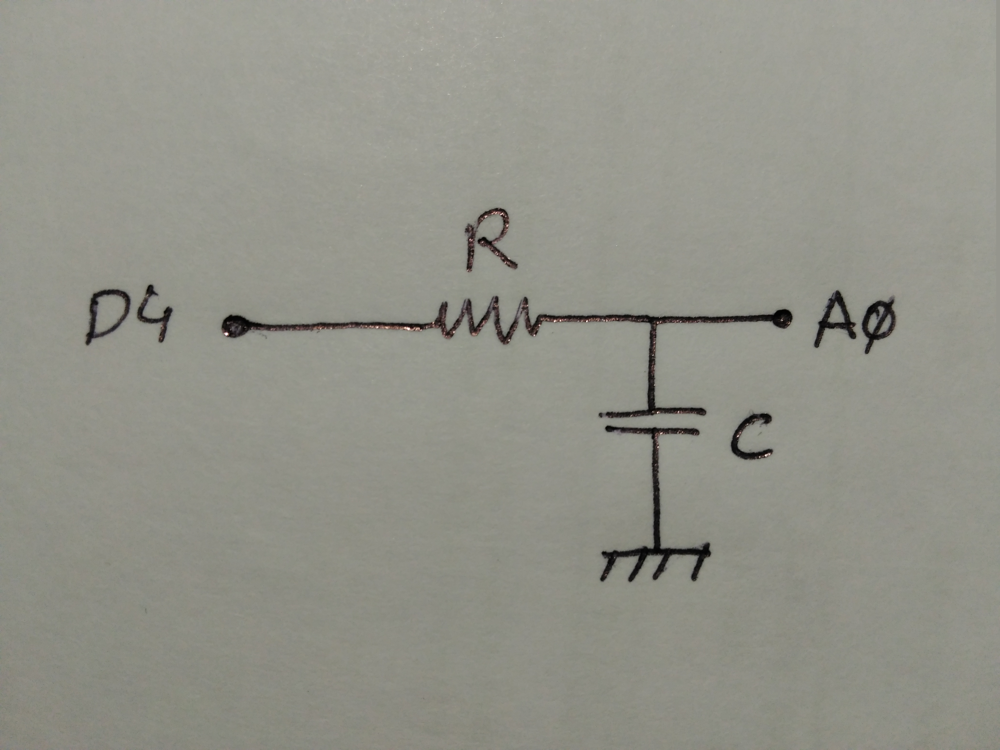

# Capacitance meter
Have you ever had to measure a capacitance without a polimeter?
This is the solution. You only need an Arduino, a resistor and some wires.

Making a low-pass RC filter you can calculate the capacitance by measuring the time constant of the filter:

## Author
[Rubén Espino San José](https://github.com/Resaj)

## License

Todos estos productos están liberados mediante [Creative Commons Attribution-ShareAlike 4.0 International License](http://creativecommons.org/licenses/by-sa/4.0/).  
_All these products are released under [Creative Commons Attribution-ShareAlike 4.0 International License](http://creativecommons.org/licenses/by-sa/4.0/)._
